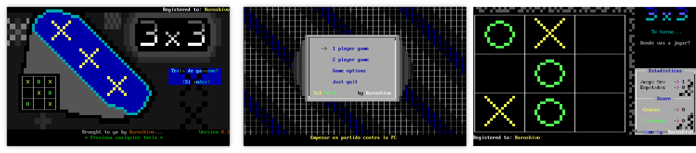

# 3x3

> [!IMPORTANT]
> This piece of software was written in 1997 when I was 14 years old.
> Please take it in an _archaeological_ sense.

A Tic-Tac-Toe implementation in QBasic running in DOS.




Please note that

  * Some messages are written in Spanish (this was written in a small city of a non-English-speaking third-world country in the nineties)
  * The binary `exe` is the original one compiled circa 1997-98.
  * I do remember having a version where one could choose the level of difficulty (it would change the thresholds for the random choices took by the computer player). I wonder why I only found this "older" version (there was no Git at the time and I would only start using CVS in 1999).


## Execution

 1. Install `dosbox` 
 
    ```
    sudo apt-get install dosbox
    ```
 
 2. Open a DOSBox terminal from this directory
 
    ```
    dosbox
    ```
 
 3. Mount the current directory as `C:` (inside the DOSBox terminal)
 
    ```
    mount C: .
    ```
    
 4. Go to the newly-mounted `C:` drive
 
    ```
    C:
    ```
 5. Run `3x3.exe`
 
    ```
    3x3
    ```

Altogether (`$` means your Unix shell and `>` means the DOSBox shell):


```
$ sudo apt-get install dosbox
$ dosbox
Z:> mount C: .
Z:> C:
C:> 3x3
```

## How to play

The playground is mapped to the layout of the numerical keypad:

```
+---+---+---+
| 7 | 8 | 9 |
+---+---+---+
| 4 | 5 | 6 |
+---+---+---+
| 1 | 2 | 3 |
+---+---+---+
```

By default you play with yellow crosses (you can change this in the "Game options" section in the main menu).
When it is your turn, press the number that corresponds to the square you want to put your cross in.
To go back to the main menu, press `Esc`.

